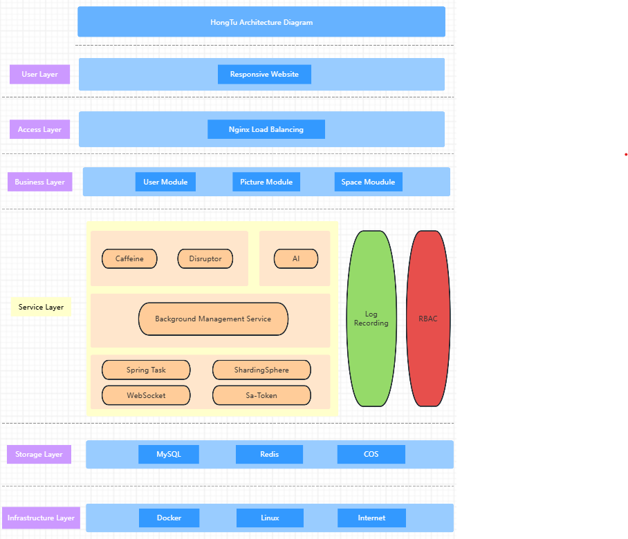

# AI-picture-backend

An enterprise-level collaborative image library platform built based on `Spring Boot + Redis + COS + AI + WebSocket`is divided into three major modules: public image library, private image library, and team-shared image library. Users can publicly upload and search for images on the platform. Administrators can upload, review, and conduct management analysis of images. Individual users can upload images to their private spaces to achieve batch management, multi-dimensional retrieval, editing, and analysis. Enterprises can open team spaces to invite members for image sharing and real-time collaborative editing. Among them, the private image library and team-shared image library have achieved content expansion for the project towards both C-end and B-end users.
 

****

## Some Basic Tools Version

JDK：`v1.8` 
Spring-boot:`v2.7.6` 
MySql:`v8.0.42` 
MyBatis-Plus:`v3.5.12` 
Redis:`v` 
Caffeine:`v` 
HuTool:`v5.8.16` 

****

## Architectural Diagram
